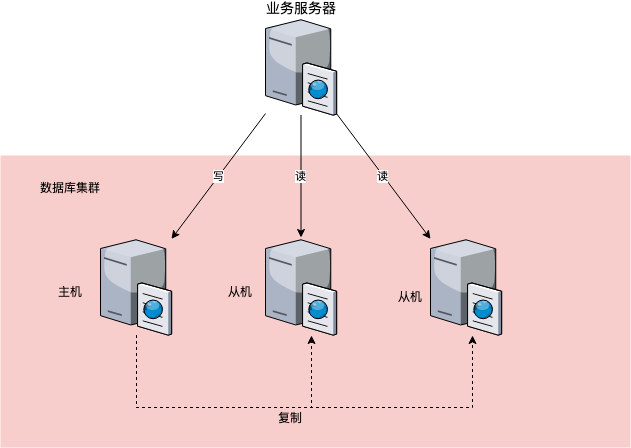

# 读写分离

结构图：

实现步骤：

1. 数据库服务器搭建主从集群，一住一从，一主多从都可以。
2. 数据库主机负责读写操作，从机只负责读操作。
3. 数据库主机通过复制，将数据同步到从机，每台数据库服务器都存储了所有的业务数据。
4. 业务服务器将写操作发给数据库主机，将读操作发给数据库从机。

解决主从复制延迟的方法：

1. 写操作后的读操作指定发给数据库主服务器
2. 读从机失败后再读一次主机
3. 关键业务读写操作全部指向主机

